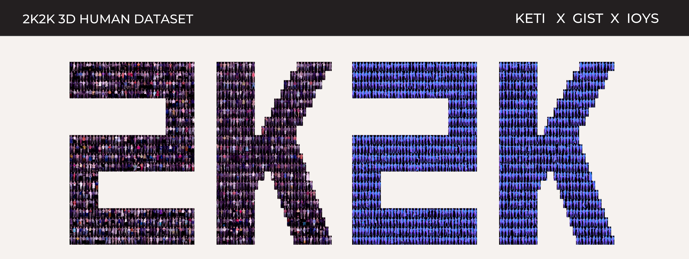

# Polygom2K2K Dataset

## High-fidelity 3D Human Digitization from Single 2K Resolution Images
[Sang-Hun Han](https://sanghunhan92.github.io/conference/2K2K/), [Min-Gyu Park](https://scholar.google.co.uk/citations?user=VUj1ZWoAAAAJ&hl=en), [Ju Hong Yoon](https://scholar.google.com/citations?user=Y4mReV4AAAAJ&hl=en), Ju-Mi Kang, Young-Jae Park and [Hae-Gon Jeon](https://sites.google.com/site/hgjeoncv/).  CVPR 2023

[[Project Page]](https://sanghunhan92.github.io/conference/2K2K/)

* This repository provides new [2K2K](https://github.com/SangHunHan92/2K2K/tree/main) dataset updated by *Polygom*.
* Specifically, we provides same 1M mesehs of original 2K2K dataset with newly updated *SMPLX* parameters and registered SMPLX via non-rigid fitting.



### Data explanation

Polygom2K2K includes 2,050(train 2000, test 50) high-fidility 3D body scans captured by 80 multi-view DSLR cameras by [IOYS](http://ioys.co.kr/). Each scan is simplified to a maximum of 1M vertices. Scans with fewer than 1M vertices are provided in their raw form. The data is provided in PLY format, including vertex colors.

Additionally, we provide the results of SMPLX rigid fitting and non-rigid registration. 

### Agreement

1. The 2K2K dataset (the "Dataset") is available for **non-commercial** research purposes only. Any other use, in particular any use for commercial purposes, is prohibited. This includes, without limitation, incorporation in a commercial product, use in a commercial service, as training data for a commercial product, for commercial ergonomic analysis (e.g. product design, architectural design, etc.), or production of other artifacts for commercial purposes including, for example, web services, movies, television programs, mobile applications, or video games. The Dataset may not be used for pornographic purposes or to generate pornographic material whether commercial or not. The Dataset may not be reproduced, modified and/or made available in any form to any third party without [IOYS](http://ioys.co.kr/)’s prior written permission.

2. You agree **not to** reproduce, modify, duplicate, copy, sell, trade, resell, or exploit any portion of the images and any portion of derived data in any form to any third party without [IOYS](http://ioys.co.kr/)’s prior written permission.

3. You agree **not to** further copy, publish, or distribute any portion of the Dataset. Except, for internal use at a single site within the same organization it is allowed to make copies of the Dataset.

4. [IOYS](http://ioys.co.kr/) reserves the right to terminate your access to the Dataset at any time.

### Contact
We are pleased to meet you! All discussions about data access and sharing are welcome. Feel free to contact by E-mail (jseob.y@polygom.xyz, mpark@polygom.xyz).


### Citation
If you use this dataset for your research, please consider citing:
```
@InProceedings{han2023Recon2K,
title={High-fidelity 3D Human Digitization from Single 2K Resolution Images},
author={Han, Sang-Hun and Park, Min-Gyu and Yoon, Ju Hong and Kang, Ju-Mi and Park, Young-Jae and Jeon, Hae-Gon},
booktitle={IEEE Conference on Computer Vision and Pattern Recognition (CVPR2023)},
month={June},
year={2023},
}
```


